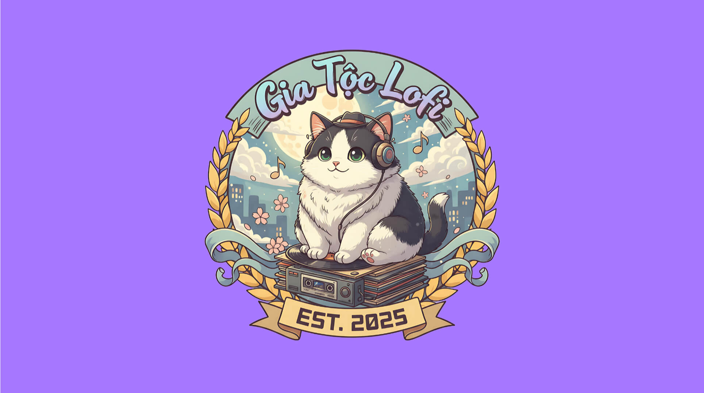

# 🎧 Lofi Family — Cộng Đồng Gia Tộc Lofi Chill

### 🇻🇳 / 🇬🇧 A Cozy Lofi-Themed Landing Page by **Wu Long**

---

## 🌸 Giới thiệu | Introduction

> 🌙 **VN:** Một không gian web nhỏ để chill cùng âm nhạc, kết nối bạn bè và sáng tạo cùng cộng đồng **Lofi Family**.  
> ✨ Thiết kế & Phát triển thủ công bằng HTML, CSS, và JavaScript — Tập trung vào trải nghiệm và cảm xúc.

> 🎵 **EN:** A minimal, lofi-inspired landing page to relax with music, share creative vibes, and connect with the **Lofi Family** community.  
> ✨ Fully handcrafted with HTML, CSS, and vanilla JavaScript — Designed for pure chill and emotion.

---

## 🛠️ Công nghệ | Tech Stack

| 🔰  | Công nghệ / Technology | Mục đích / Purpose                                 |
| --- | ---------------------- | -------------------------------------------------- |
| 🌐  | **HTML5**              | Xây dựng cấu trúc nội dung / Build page structure  |
| 🎨  | **CSS3**               | Hiệu ứng giao diện & animation / UI & animations   |
| ⚙️  | **JavaScript (ES6)**   | Logic tương tác, hiệu ứng động / Interactive logic |
| 💌  | **Formspree API**      | Gửi góp ý / Handle form submissions                |
| 🌓  | **LocalStorage API**   | Ghi nhớ chế độ sáng–tối / Save theme preference    |
| 📱  | **Responsive Design**  | Hỗ trợ mobile & desktop / Works across devices     |

---

## 🌈 Tính năng | Features

| 🌟                                  | Mô tả / Description                           |
| ----------------------------------- | --------------------------------------------- |
| 🌗 Chuyển đổi **Light / Dark Mode** | Smooth theme switcher with memory             |
| 🎧 Nhạc nền Lofi                    | Background Lofi player with autoplay fix      |
| 📸 **Slider ảnh** + Lightbox        | Auto-sliding gallery with zoom effect         |
| 💫 Hiệu ứng sao băng + đánh máy     | Shooting stars & typing animation             |
| 🖼️ **Avatar Generator**             | Random Lofi avatars (downloadable)            |
| 💬 **Form góp ý sự kiện**           | Popup “Thank You” after submission            |
| 🚫 Chặn sao chép nội dung           | Disable text selection & copying              |
| ⚡ JS tối ưu                        | Throttle, animation cleanup, and modular code |

---

## 📂 Cấu trúc dự án | Project Structure

```
📦 lofi-family/
├── index.html
├── css/
│   └── style.css
├── js/
│   ├── effect_mix.js          # Sao băng + Hiệu ứng đánh máy / Shooting star + Typing
│   ├── feedback_event.js      # Góp ý / Feedback popup
│   ├── light_dark_mode.js     # Chuyển theme / Theme toggle
│   ├── music_lofi.js          # Nhạc nền / Lofi music player
│   ├── pfp_generator.js       # Avatar ngẫu nhiên / Random avatar generator
│   └── slider_lightbox.js     # Slider & zoom ảnh / Image slider + Lightbox
├── image/
│   ├── avatar/
│   ├── thumbnail/
│   └── favicon/
├── music/
│   └── Ocean Eyes.mp3
└── site.webmanifest
```

---

## 💻 Demo

🔗 **Live:** [https://callmewulong.github.io/lofi/](https://callmewulong.github.io/lofi/)  
📱 **Hỗ trợ:** Chrome · Edge · Safari · Android · iOS  
🌍 **Supported:** All modern browsers and mobile devices

---

## 😆 Tác giả | Author

**Designed & Developed by [Wu Long](https://x.com/callmewulong)**

> 🇻🇳 _“Chill cùng âm nhạc, kết nối bằng cảm xúc.”_  
> 🇬🇧 _“Chill with music, connect through emotions.”_

---

## ⚖️ Giấy phép | License

Phát hành theo **MIT License**  
Released under the **MIT License** — Feel free to use, remix, and share with credit.

---

## 📸 Gợi ý | Tips

Thêm ảnh preview để README nổi bật hơn:

```markdown

```

Hoặc thêm badge công nghệ:

```markdown


```

---

💜 _Lofi Family — Cộng đồng sáng tạo dành cho những tâm hồn chill._  
💫 _A creative space for souls that love to chill._
